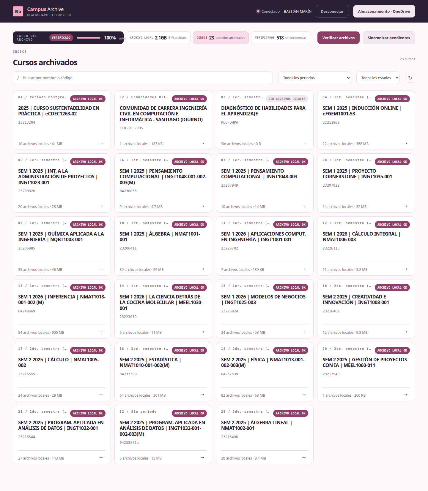

# Campus Archive — Blackboard Backup Scraper

Herramienta web para respaldar todo el contenido de Blackboard Learn (Universidad Mayor) y almacenarlo localmente o en OneDrive.



## Funcionalidades

- **Descarga completa de cursos** — archivos, carpetas, metadatos, anuncios, mensajes, notas y grabaciones Collaborate
- **Panel web** — interfaz Flask con diseño responsive, modo claro
- **Almacenamiento flexible** — carpeta local o OneDrive (detección automática en Windows/WSL)
- **Sincronización incremental** — solo descarga archivos nuevos o modificados (SHA-256)
- **Verificación de integridad** — escaneo de archivos locales vs remotos con barra de progreso
- **Manifiesto local** — `manifest.json` con hash, tamaño, fecha de modificación por archivo
- **Organización automática** — `Semestre/Curso/contenido/` con metadatos JSON
- **Soporte Collaborate** — detección y descarga de grabaciones de sesiones
- **Autenticación vía Playwright** — soporte para login con cookies o script de consola

## Requisitos

- Python 3.10+
- Playwright (para autenticación inicial)
- OneDrive (opcional, para almacenamiento en nube)

## Instalación

### Linux / WSL

```bash
bash <(curl -sSL https://raw.githubusercontent.com/iiroak/BlackBoardScrapper/main/install.sh)
```

Crea el comando `campus-archive`. Para actualizar, corré el mismo comando.

### Windows (PowerShell)

```powershell
irm https://raw.githubusercontent.com/iiroak/BlackBoardScrapper/main/install.ps1 | iex
```

Te deja un acceso directo `Campus Archive.bat` en el escritorio. Si pide permisos de admin para Chromium, cerralo y volvé a correr PowerShell como administrador.

### Manual

```bash
git clone https://github.com/iiroak/BlackBoardScrapper.git
cd BlackBoardScrapper
python -m venv venv
source venv/bin/activate  # o venv\Scripts\activate en Windows
pip install -r requirements.txt
playwright install chromium
```

## Uso

### Interfaz web

```bash
python run.py
```

Abre `http://localhost:5000`. La app guía el proceso de conexión a Blackboard, escaneo de cursos y descarga.

### Línea de comandos

```bash
python main.py
```

Descarga todos los cursos del usuario autenticado a la carpeta de almacenamiento configurada.

## Estructura del proyecto

```
BlackBoardScrapper/
├── app.py              # Servidor Flask y endpoints API
├── auth.py             # Autenticación con cookies de Playwright
├── bb_client.py        # Cliente de Blackboard Learn API
├── collab_client.py    # Cliente de Blackboard Collaborate
├── config.py           # Configuración central (URLs, timeouts)
├── content_sync.py     # Sincronización de árbol de contenido
├── downloader.py       # Descarga de archivos con reintentos
├── main.py             # Entry point CLI
├── maintenance.py      # Tareas de mantenimiento
├── manifest.py         # Gestión del manifiesto JSON
├── organizer.py        # Organización de archivos en disco
├── storage.py          # Detección y migración de almacenamiento
├── run.py              # Lanzador de la interfaz web
├── extract_session.py  # Extracción de sesión de cookies
├── static/             # CSS, JS, SVG
├── templates/          # HTML (Jinja2)
├── tests/              # Tests unitarios
├── images/             # Capturas para documentación
├── requirements.txt
└── LICENSE
```

## Stack

| Componente | Tecnología |
|-----------|-----------|
| Backend | Python 3.12, Flask |
| Auth | Playwright (Chromium headless) |
| API | Blackboard Learn REST API |
| Almacenamiento | Sistema de archivos local / OneDrive |
| Frontend | HTML5, CSS3, Vanilla JS |

## Licencia

MIT — ver [LICENSE](LICENSE)
